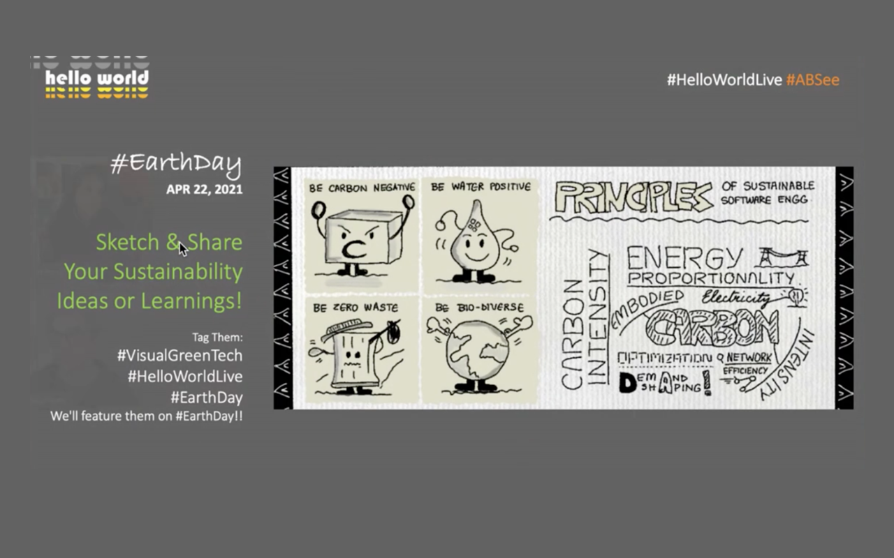

# The #VisualGreenTech challenge 

The [#VisualGreenTech Challenge](https://techcommunity.microsoft.com/t5/green-tech-blog/visualgreentech-challenge-earthday-2021/ba-p/2257548?WT.mc_id=mobile-24661-ninarasi) was launched in April 2021 as a precursor to the #EarthDay celebrations on Apr 22. The objective was to increase user awareness and action around sustainability practices in home, work, and community environments. And the approach involved sharing one prompt a day (for 24 days) encouraging readers to explore a specific resource, and share their learnings with a visual.

---

## Exploratory Resources:

Each prompt led the user to a specific resource for self-exploration. Here are the main destinations:

 * [#VisualGreenTech Challenge: Earth Day 2021](https://techcommunity.microsoft.com/t5/green-tech-blog/visualgreentech-challenge-earthday-2021/ba-p/2257548?WT.mc_id=mobile-24661-ninarasi) - _Microsoft Green Tech Blog_.
 * [The Principles of Sustainable Software Engineering](https://docs.microsoft.com/en-us/learn/modules/sustainable-software-engineering-overview/?WT.mc_id=mobile-24661-ninarasi) - _Microsoft Learn Module_
 * [Lumen Power Challenge](https://education.minecraft.net/lessons/lumen-power-challenge?WT.mc_id=mobile-24661-ninarasi) - _Minecraft Education Edition_
 * [Lumen City Challenge](https://education.minecraft.net/lessons/lumen-city-challenge?WT.mc_id=mobile-24661-ninarasi) - _Minecraft Education Edition_
 * [Sustainability City](https://education.minecraft.net/worlds/sustainability-city?WT.mc_id=mobile-24661-ninarasi) - _Minecraft Education Edition_

---

## Hello World Live! #EarthDay

The challenge was created as a collaboration between the Green Advocacy team and members of the Hello World Live hosting and producing teams, leading up to a special [#EarthDay themed show](https://dev.to/azure/hello-world-hello-earth-1f8l) on April 22, 2021. The VisualGreenTech challenge formally launched April 1, 2021 during the #ABSee segement which explores visual storytelling.

Watch the #ABSee segments of Hello World live here, with the #EarthDay special takeover of the whole show on Apr 22. A final review segment may happen in May.

 * [Apr 1, 2021](https://channel9.msdn.com/Shows/Hello-World/Hello-World-April-1-2021#time=21m21s?WT.mc_id=mobile-24661-ninarasi)
 * [Apr 8, 2021](https://channel9.msdn.com/Shows/Hello-World/Hello-World-April-8-2021#time=21m22s?WT.mc_id=mobile-24661-ninarasi)
 * [Apr 15, 2021](https://channel9.msdn.com/Shows/Hello-World/Hello-World-April-15-2021#time=22m12s?WT.mc_id=mobile-24661-ninarasi)
 * [Apr 22, 2021](https://channel9.msdn.com/Shows/Hello-World/Hello-World-April-22-2021-Special-Hello-Earth?WT.mc_id=mobile-24661-ninarasi)
 * [Apr 29, 2021](https://channel9.msdn.com/Shows/Hello-World/Hello-World-Thursday-April-29-2021#time=19m46s?WT.mc_id=mobile-24661-ninarasi)

---

## Under The Hood

This blog is being built using the [Hugo](https://gohugo.io/getting-started/quick-start/) static site generator, with hosting on [GitHub Pages](https://gohugo.io/hosting-and-deployment/hosting-on-github/). Read about the process on my [SETUP](SETUP.md) page.

---